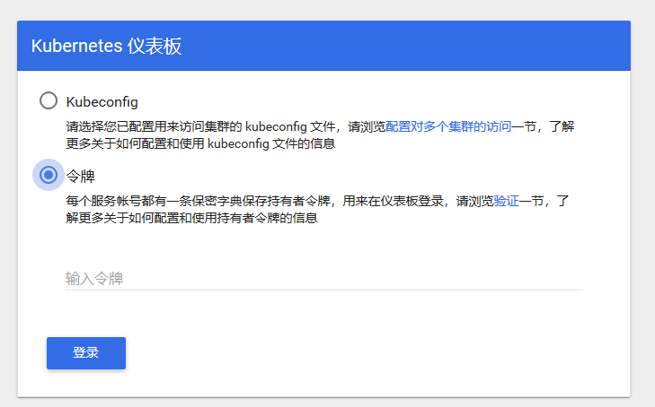
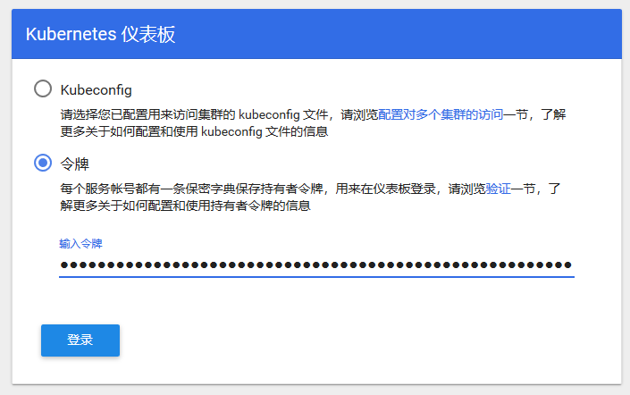
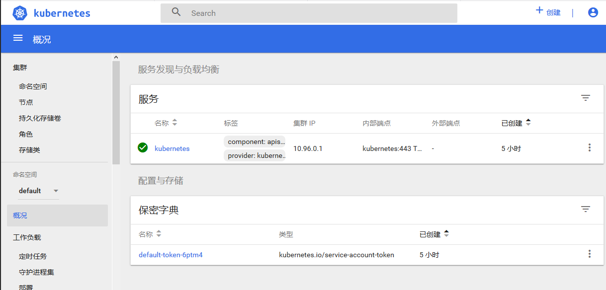
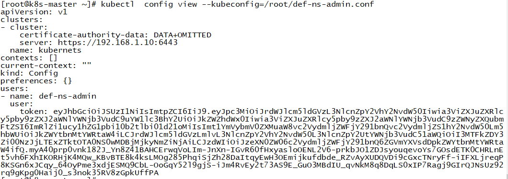
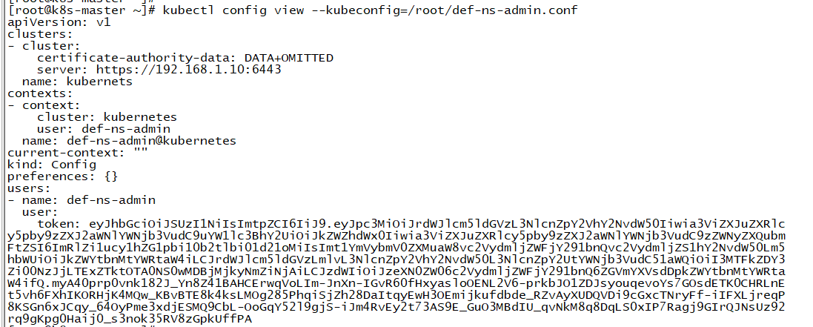
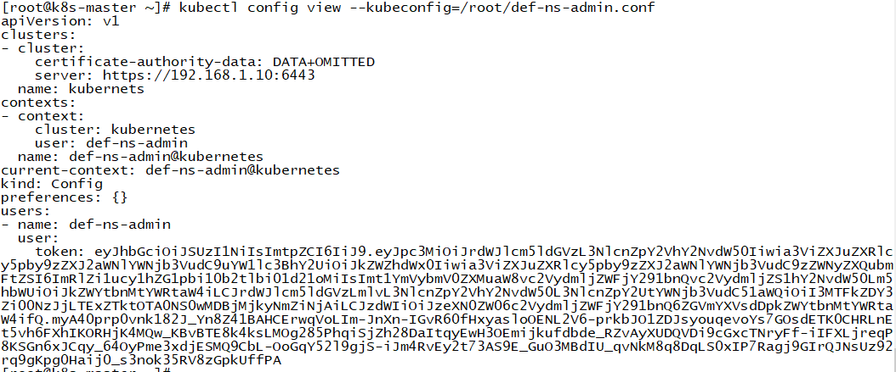
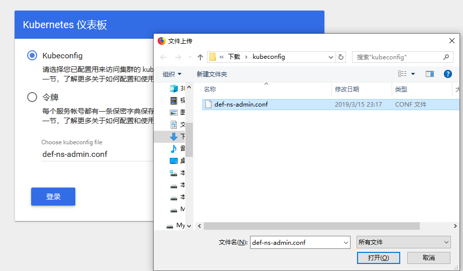
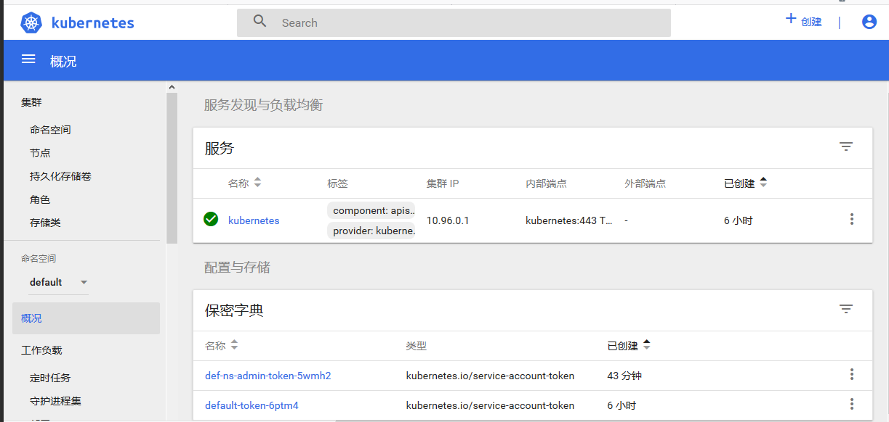

## 获取镜像

```
[root@k8s-master ~]# docker pull registry.cn-hangzhou.aliyuncs.com/dengyou/kubernetes-dashboard-amd64:v1.10.1
[root@k8s-master ~]# docker tag registry.cn-hangzhou.aliyuncs.com/dengyou/kubernetes-dashboard-amd64:v1.10.1 k8s.gcr.io/kubernetes-dashboard-amd64:v1.10.1
[root@k8s-master ~]# docker rmi registry.cn-hangzhou.aliyuncs.com/dengyou/kubernetes-dashboard-amd64:v1.10.1
[root@k8s-master ~]# docker save k8s.gcr.io/kubernetes-dashboard-amd64:v1.10.1 -o kubernetes_dashboard.tar
[root@k8s-master ~]# scp kubernetes_dashboard.tar k8s-node1:/root
[root@k8s-master ~]# scp kubernetes_dashboard.tar k8s-node2:/root
```
## 部署 `dashboard`

```
[root@k8s-master ~]# kubectl apply -f https://raw.githubusercontent.com/kubernetes/dashboard/v1.10.1/src/deploy/recommended/kubernetes-dashboard.yaml
[root@k8s-master ~]# kubectl patch svc kubernetes-dashboard -p '{"spec":{"type": "NodePort"}}' -n kube-system
```


访问：`https://192.168.1.21:32266`



## 使用令牌 `token`认证

- 创建一个 **Serviceaccount** 账户：`dashboard-admin`
```
[root@k8s-master ~]# kubectl  create serviceaccount dashboard-admin -n kube-system                                  ^C
[root@k8s-master ~]# kubectl  get sa -n kube-system |grep --color dashboard-admin                               
dashboard-admin                      1         101s
```

- 将 **Serviceaccount** 账户与集群进行 `clusterrolebinding`
```
[root@k8s-master ~]# kubectl  create clusterrolebinding dashboard-cluster-admin --clusterrole=cluster-admin --serviceaccount=kube-system:dashboard-admin
clusterrolebinding.rbac.authorization.k8s.io/dashboard-cluster-admin created
```

- 获取对应的 serviceaccount 的secret 信息，并且通过这个secret 访问集群
```
// dashboard-admin 的 secret 信息
[root@k8s-master ~]# kubectl get secret -n kube-system|grep --color dashboard-admin
dashboard-admin-token-xtp9d                      kubernetes.io/service-account-token   3      14m
```


我们可以通过 `token` 进行登录




## 使用 `KubeConfig` 认证

- 创建一个 **Serviceaccount** 账户：`def-ns-admin`
```
[root@k8s-master ~]# kubectl  create serviceaccount def-ns-admin -n default
serviceaccount/def-ns-admin created
```
- 将 **Serviceaccount** 账户与节点进行 `rolebinding`
```
[root@k8s-master ~]# kubectl  create rolebinding def-ns-admin --clusterrole=admin --serviceaccount=default:def-ns-admin 
rolebinding.rbac.authorization.k8s.io/def-ns-admin created
```

> Note：这里是 `rolebinding`,我们希望此用户只对default namespace 有管理权限，至此我们已经可以通过获取用户的 `token`,通过令牌进行登录了，但是如果我们需要通过使用`kubeconfig`的方式进行登录，则需要继续一下操作，好了，咱们继续配置吧

- 设置集群：`kubernets`
```
[root@k8s-master ~]# kubectl  config set-cluster kubernets --certificate-authority=/etc/kubernetes/pki/ca.crt  --server="https://192.168.1.10:6443" --embed-certs=true --kubeconfig=/root/def-ns-admin.conf
Cluster "kubernets" set.
```


- 使用 `serviceaccount` 信息中的`token`作为创建用户的认证信息

```
[root@k8s-master ~]# kubectl get secret
NAME                       TYPE                                  DATA   AGE
def-ns-admin-token-5wmh2   kubernetes.io/service-account-token   3      32m
default-token-6ptm4        kubernetes.io/service-account-token   3      6h42m
[root@k8s-master ~]# DEF_NS_ADMIN_SECRET=`kubectl get secret def-ns-admin-token-5wmh2  -o jsonpath={.data.token}`
[root@k8s-master ~]# DEF_ADMMIN_TOKEN=`echo $DEF_NS_ADMIN_SECRET |base64 -d`
[root@k8s-master ~]# kubectl  config set-credentials def-ns-admin --token=$DEF_ADMMIN_TOKEN --kubeconfig=/root/def-ns-admin.conf 
User "def-ns-admin" set.
```


- 设置 `context` ,将 `serviceaccount` 用户、 `service` 和 `kubeconfig` 文件进行整合
```
[root@k8s-master ~]# kubectl  config set-context def-ns-admin@kubernetes --cluster=kubernetes --user=def-ns-admin --kubeconfig=/root/def-ns-admin.conf 
Context "def-ns-admin@kubernetes" created.
```


- 使用此`context`
```
[root@k8s-master ~]# kubectl config use-context def-ns-admin@kubernetes --kubeconfig=/root/def-ns-admin.conf 
Switched to context "def-ns-admin@kubernetes".
```


- 使用kubeconfig进行登录

我们把 `/root/def-ns-admin.conf` 发给给用户，用户在登陆时选择此账号就能进行登录了





参考链接：https://github.com/kubernetes/dashboard